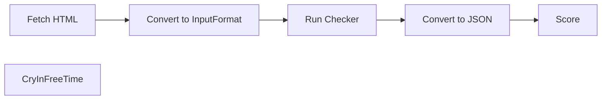

<div align="center">
<svg xmlns="http://www.w3.org/2000/svg" font-family="Helvetica" font-size="320"
height="200px" width="200px" font-weight="700" viewBox="0 0 512 512">
<defs>
  <clipPath id="a">
    <rect width="100%" height="100%"  rx="64"/>
  </clipPath>
</defs>
<g clip-path="url(#a)">
<rect width="100%" height="100%" fill="#fc3"/>
<path fill="#349" d="M0 0h192l128 512H0z"/>
<text x="-102"  y="415" transform="rotate(-13)" fill="#fc3">A</text>
<text x="250"  y="425" transform="rotate(-15)" fill="#349">Y</text>
<text x="100"  y="360" transform="rotate(-15) translate(-50,60)" fill="#fc3">1</text>
<text x="230" y="360" transform="rotate(165) translate(-544,-555)"  fill="#349">1</text>
</g>
</svg>
<h1>a11yscore</h1>
</div>

A local piece of code to score websites as per their accessibility. 4 tools are being used and averaged so that we don't miss out on any features. If i see that long terms its getting too redundant, I'll get rid of what I feel is redundant.

> please ignore `/out`, its just a data dump and isn't meant to be human readable.

Powered by
|Company| Tool|
|---|---|
|Deque Systems| Axe|
|IBM| Accessibility Checker|
|Independent | Pa11y|

We will not use `Google Lighthouse` since under the hood it basically uses `axe-core`.

## Usage
```bash
$ node ./run.js
$ bun ./process.js
```

## Setup
```bash
$ npm install -g accessibility-checker
```

## Usages
### Deque Systems Axe

### IBM Accessibility Checker
```bash
$ accessibility-checker https://www.nic.in/ --output-file nic.json
```

### Pa11y

## Technical
General Process


<!--
https://www.nic.in/
 -->