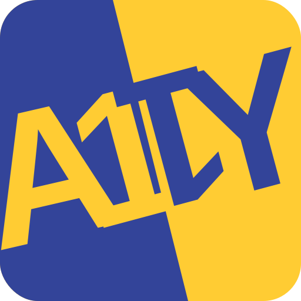

<div align="center">

<h1>a11yscore</h1>
</div>

> This project is not ready to use.
> It is temporarily archived since I will not develop this now and continue a few months later. (Goals are different/No time)

Objective is just to be able to do mass scoring and not fall into the trap of [Goodhart's Law](https://en.wikipedia.org/wiki/Goodhart%27s_law). 90+ is reasonable on Lighthouse. There are also plans to integrate with [@khan/tota11y](https://github.com/khan/tota11y) to actually see how to make changes and break down reports into simple english

A script to score websites as per their accessibility. 3 tools are being used and averaged so that we don't miss out on any features. If i see that long term something is getting too redundant, I'll get rid of it. 

Powered by
|Company| Tool|
|---|---|
|Google | Lighthouse (Axe) |
|IBM| Karma|
|Independent | Pa11y|

Later we will not use `Google Lighthouse` since under the hood it basically uses `axe-core`, but right now thats basically what we are doing.

## Temporary Usage
This will be much cleaner once its done
```bash
$ node ./run.js
$ bun ./process.js
```

## Todos
- Add multiple retrys with https -> http -> full url without stripping query
- Ad
