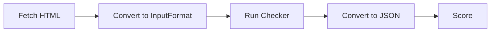

# a11yscore
A local piece of code to score websites as per their accessibility

Powered by
|Company| Tool|
|---|---|
|Google| Lighthouse|
|Deque Systems| Axe|
|IBM| Accessibility Checker|
|Independent | Pa11y|

## Usages
### Google Lighthouse

### Deque Systems Axe

### IBM Accessibility Checker

### Pa11y

## Technical
General Process
