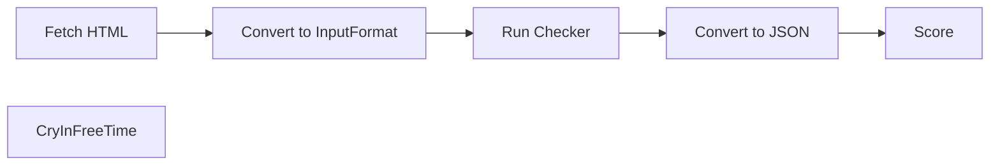

# a11yscore
A local piece of code to score websites as per their accessibility. 4 tools are being used and averaged so that we don't miss out on any features. If i see that long terms its getting too redundant, I'll get rid of what I feel is redundant.

> please ignore `/out`, its just a data dump and isn't meant to be human readable.

Powered by
|Company| Tool|
|---|---|
|Deque Systems| Axe|
|IBM| Accessibility Checker|
|Independent | Pa11y|

We will not use `Google Lighthouse` since under the hood it basically uses `axe-core`.

## Usage
```bash
$ node ./run.js
$ bun ./process.js
```

## Setup
```bash
$ npm install -g accessibility-checker
```

## Usages
### Deque Systems Axe

### IBM Accessibility Checker
```bash
$ accessibility-checker https://www.nic.in/ --output-file nic.json
```

### Pa11y

## Technical
General Process


<!--
https://www.nic.in/
 -->